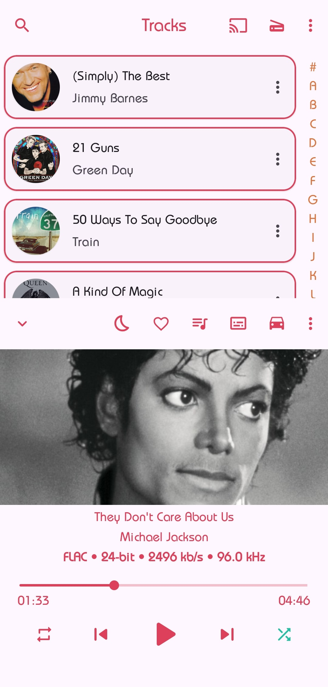

    
    <h1 align="center">Apex Music</h1>
  </a>

  
  
  
  <a href="https://github.com/TheTerminatorOfProgramming/ApexMusic/blob/master/LICENSE.md" style="text-decoration:none" area-label="License: GPL v3">
    
  </a

## Screenshots
### App Themes
|  |  |  |  |  |
|:---:|:---:|:---:|
|Clearly white| Kinda dark | Just black | Material U white(A12+) | Material U dark(A12+)

### Player screen
| | | |
|:---:|:---:|:---:|:---:|:---:|
| Home | Settings | LockScreen Controls

### 10+ Now playing themes
| 	||     	|     	|     	|
|:-----:	|:-----:	|:-----:	|:-----:	|:-----:	|
| Normal 	| Fit 	| Flat 	| Color 	| Material 	|

| 	||     	|     	|     	|
|:-----:	|:-----:	|:-----:	|:-----:	|:-----:	|
| Classic 	| Adaptive 	| Blur 	| Tiny 	| Peek 	|

___

## Colorful
3 color themes: Bright White, Sorta Dark and Jet Black.
Select your favorite accent color

## Home
Where you can view your recently/top played artists, albums and
favorite songs.

## Included Features
-  3 themes (Bright White, Sorta Dark and Jet Black)
-  Chromecast support
-  Choose from 10+ now playing themes
-  Driving Mode
-  Headset/Bluetooth support
-  Music duration filter
-  Android auto support
-  Wallpaper accent picker on Android 8.1+
-  Material You support on Android 12+
-  Monet themed icon support on Android 13+
-  Folder support - Play songs by folder
-  Gapless playback
-  Volume controls
-  Carousel effect for album covers
-  Home screen widgets
-  Lock screen playback controls
-  Lyrics screen (download and sync with music)
-  Sleep timer
-  Easy drag to sort playlist & play queue
-  Tag editor
-  Create, edit and import playlists
-  Playing queue with reorder
-  User profile (can disable this)
-  Browse and play your music by songs, albums, artists, playlists and
  genre
-  Smart Auto Playlists - Recently played, most played and history
-  Build your playlist on the go

## License

Apex Music is released under the GNU General Public License v3.0
(GPLv3), which can be found [here](LICENSE.md)

>Please note: Apex Music is an offline music player app. It
>doesn't support music downloading or online music streaming.
