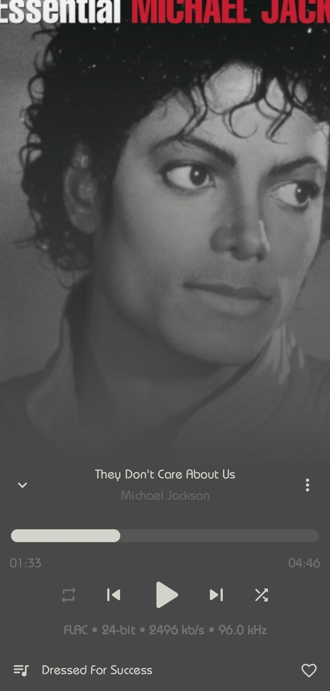

    
    <h1 align="center">Apex Music</h1>
  </a>

  
  
  
  <a href="https://github.com/TheTerminatorOfProgramming/ApexMusic/blob/master/LICENSE.md" style="text-decoration:none" area-label="License: GPL v3">
    
  </a

 
   
 

    <a href="https://play.google.com/store/apps/details?id=cm.ttop.app.apex">
        
    </a
        <a href="https://github.com/TheTerminatorOfProgramming/ApexMusic/releases/latest">
        
    </a
        <a href="https://theterminatorofprogramming.github.io/download/Apex_Music_Stable_latest.apk">
        
    </a

    
## Screenshots
      
### App Themes
||||
|:-----:	|:-----:	|:-----:	|
| Bright White 	| Sorta Dark 	| Jet Black 	| 

||||
|:-----:	|:-----:	|:-----:	|
| Material U Light (A12+) 	| Material U Dark (A12+) 	| Material U Black (A12+) 	|

### User Interface
|||||
|:-----:	|:-----:	|:-----:	|:-----:	|
| Home 	| Songs 	| Albums 	| Artists 	|

|||||
|:-----:	|:-----:	|:-----:	|:-----:	|
| Playlists 	| Playlists(Empty) 	| Settings 	| Lockscreen 	|

### 15+ Now playing themes
|||||
|:-----:	|:-----:	|:-----:	|:-----:	|
| Gradient 	| Swipe 	| Material 	| Peek 	|      
      
|||||
|:-----:	|:-----:	|:-----:	|:-----:	|
| Normal 	| Fit 	| Flat 	| Color 	|

|||||
|:-----:	|:-----:	|:-----:	|:-----:	|
| Classic 	| Adaptive 	| Blur 	| Tiny 	|

### Widgets
||||
|:-----:	|:-----:	|:-----:	|
| Classic 	| Full 	| Circle 	|

___
## About
Apex Music is an offline open source music player optimised for foldables and is forked from [Retro Music Player](https://github.com/RetroMusicPlayer/RetroMusicPlayer)
___    
## Colorful
3 color themes: Bright White, Sorta Dark and Jet Black.
Select your favorite accent color

## Home
Where you can view your recently/top played artists, albums and
favorite songs.

## Included Features
-  3 themes (Bright White, Sorta Dark and Jet Black)
-  Chromecast support
-  Choose from 15+ now playing themes
-  Driving Mode
-  Headset support
-  Music duration filter
-  Android auto support
-  Wallpaper accent picker on Android 8.1+
-  Material You support on Android 12+
-  Monet themed icon support on Android 13+
-  Folder support - Play songs by folder
-  Gapless playback
-  Volume controls
-  Carousel effect for album covers
-  Home screen widgets
-  Lock screen playback controls
-  Lyrics screen (download and sync with music)
-  Sleep timer
-  Easy drag to sort playlist & play queue
-  Tag editor
-  Create, edit and import playlists
-  Playing queue with reorder
-  User profile (can disable this)
-  Browse and play your music by songs, albums, artists, playlists and
  genre
-  Smart Auto Playlists - Recently played, most played and history
-  Build your playlist on the go

## License

Apex Music is released under the GNU General Public License v3.0
(GPLv3), which can be found [here](LICENSE.md)

>Please note: Apex Music is an offline music player app. It
>doesn't support music downloading or online music streaming.

## Icon
      
The icon is based on <a href="https://www.flaticon.com/free-icon/sound_865548?term=music" title="sound icon">Sound Icon created by Good Ware - Flaticon</a>, which i have edited
